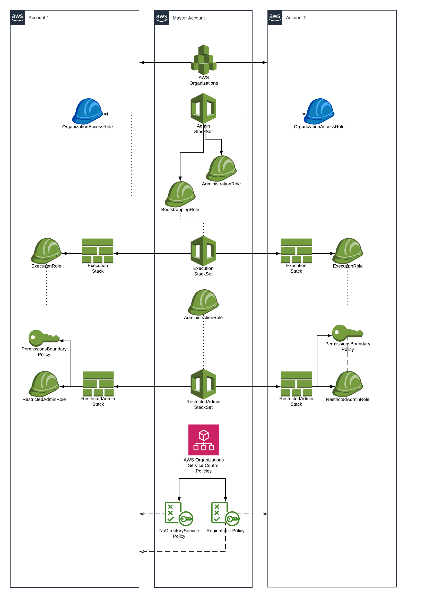

# AWS Organizations and Service Control Policies

In this workshop we will develop a multiaccount centrally-managed AWS setup
that allows its sub-accounts' users to manage their own IAM Roles and Policies
without introducing Privilege Escalation vulnerabilities.

This repository is a simplified approach to implementing this model. It covers
the core ideas and services used for demonstration purposes. In a real world
implementation, resources need to be developed with much more care and detail. 

## Prerequisites

*   Do not use your account's root credentials. Use an IAM entity such as a
    User or a Role.
*   Ensure your AWS CLI is configured and working with your account.
*   Ensure your account does not belong to an AWS Organization.
*   Ensure you're using the Sydney region at all times.
*   Your IAM entity needs to be able to create manage AWS Organizations, IAM,
    and CloudFormation.

## Steps

We will go through the steps one by one. Each step should take about 20 minutes
to complete. The instructions will cover manual steps as well as Infra as Code
approach for achieving the same results.

1.  Create accounts in AWS Organizations
1.  Create CloudFormation StackSets
1.  Deploy RestrictedAdmin IAM entities
1.  Create Service Control Policies

If at any point you wish to move to the next step without making the code
changes, simply switch to the corresponding git branch of the next step.

## Architecture

## Special Thanks
*   Priya Mandiga
*   Simon Warren
*   Robert Rocco
