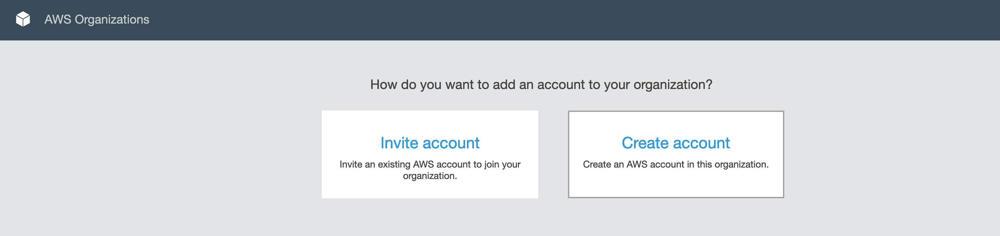
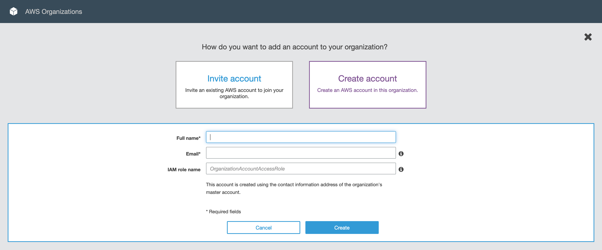
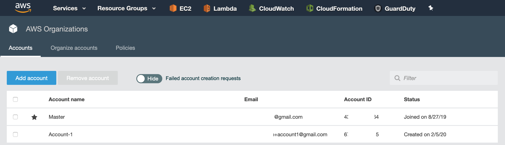
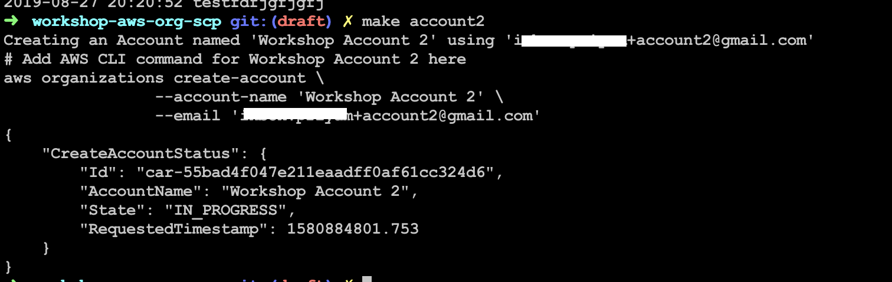
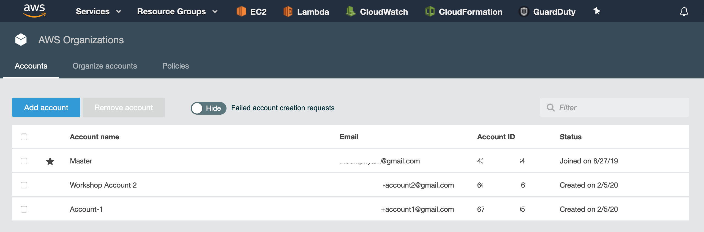

## AWS Organizations

First, we are going to need a couple of AWS accounts.

1. Log on to your AWS account. Let's call this _the master_ account.

1. Go to **AWS Organizations**.


1. Click on **Add account**.


1. Click on **Create account**.



1. Add an account with the following details:
    * **Full name:** `Workshop Account 1`  
      **Email:** `yourusername+account1@yourgoogledomain`  
      **IAM role name:** (leave blank) `OrganizationAccountAccessRole`




1. Now create a second account, using AWS CLI.
    1. Open `Makefile`.
    1. Modify `ACC2_EMAIL` variable to `yourusername+account2@yourgoogledomain`
    1. Add the following command to the `account2` target:
        ```Makefile
        aws organizations create-account \
        	--account-name '$(ACC2_NAME)' \
        	--email '$(ACC2_EMAIL)'
        ```
    1. Run
       ```Bash
        $ make account2
        ```

  

1. Go back to **AWS Organizations** and note account numbers for your master
   account as well as the two new accounts we just created.  
   This may take a minute to show.
   


2. Open `Makefile` and set values of each account number variable accordingly.

Let's access these accounts.

1. From your account's context menu, click on **Switch Role**.


1. Enter the following details:
    * **Account:** (Account 1's number)  
      **Role:** OrganizationAccountAccessRole  
      **Display Name:** Workshop Account 1  
      **Color:** Yellow (3rd box from the left)

    From the context menu, click on **Switch Role** again.

    * **Account:** (Account 2's number)  
      **Role:** OrganizationAccountAccessRole  
      **Display Name:** Workshop Account 2  
      **Color:** Blue (5th box from the left)

You can now switch between your accounts with only a couple of clicks.

`OrganizationAccountAccessRole` is a role that exists in sub-accounts that have
the `AdministratorAccess` policy attached while having a trust relationship
with the master account they were created from.

Move onto the next step.

### Further Reading
* https://aws.amazon.com/organizations/getting-started/
* https://aws.amazon.com/blogs/security/how-to-use-aws-organizations-to-automate-end-to-end-account-creation/
