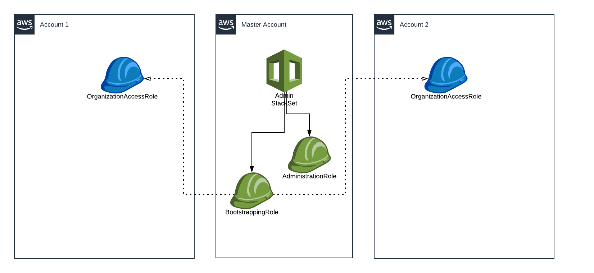
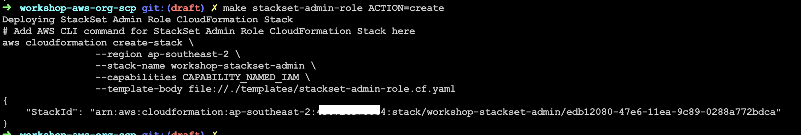

## CloudFormation StackSets

Now that the accounts are created, we are going to need a way to deploy
resources into them.

### Diagram



### StackSet Admin Roles

We can use CloudFormation to deploy a template into multiple accounts. In order
to do so, CloudFormation needs to assume a role in the master account that can
assume another role in each sub-account which is permitted to build resources
in that specific account.

1.  Review `templates/stackset-admin-roles.cf.yaml`.

1.  Add the following snippet `stackset-admin-roles` target in `Makefile`:
    ```Makefile
    aws cloudformation $(ACTION)-stack \
    	--region $(REGION) \
    	--stack-name $(STACKSETADMIN_STACKNAME) \
    	--capabilities CAPABILITY_NAMED_IAM \
    	--template-body file://./templates/stackset-admin-roles.cf.yaml
    ```

>   **NOTE:** Makefile does not like space indentations. Make sure you're using
>   tabs!

1.  Deploy this template running
    ```Bash
    $ make stackset-admin-roles ACTION=create
    ```
    

Now we need to create an IAM Role in each sub-account that allows master
account's admin role from the previous step assume it. We give this role
permissions to manage IAM resources.

We are going to deploy this role using StackSets because we want this resource
to be managed centrally. But wait a minute! We have a chicken and egg problem.

How can we deploy resources required by StackSets, using StackSets? We can use
`OrganizationAccountAccessRole` to achieve this.

Let's create another role that is permitted to make use of this role, but only
one-off and only for bootstrapping purposes.

1.  Add the following snippet to `templates/stackset-admin-roles.cf.yaml`.
    ```YAML
    BootstrappingRole:
      Type: AWS::IAM::Role
      Properties:
        RoleName: WorkshopCloudFormationStackSetBoostrapRole
        AssumeRolePolicyDocument:
          Version: 2012-10-17
          Statement:
            - Effect: Allow
              Principal:
                Service: cloudformation.amazonaws.com
              Action:
                - sts:AssumeRole
        Path: /
        Policies:
          - PolicyName: AssumeRole-OrganizationAccountAccessRole
            PolicyDocument:
              Version: 2012-10-17
              Statement:
                - Effect: Allow
                  Action:
                    - sts:AssumeRole
                  Resource:
                    - "arn:aws:iam::*:role/OrganizationAccountAccessRole"
    ```

1.  Update our existing Stack
    ```Bash
    $ make stackset-admin-roles ACTION=update
    ```

We can now see two new roles created in the IAM console.


### Further Reading

*   https://docs.aws.amazon.com/AWSCloudFormation/latest/UserGuide/stacksets-prereqs.html
*   https://aws.amazon.com/blogs/aws/use-cloudformation-stacksets-to-provision-resources-across-multiple-aws-accounts-and-regions/
