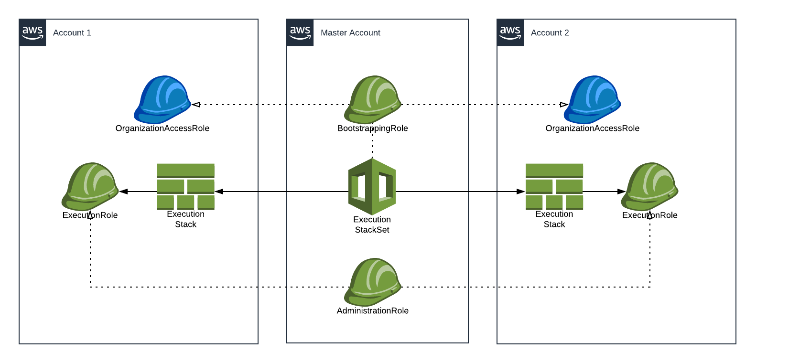
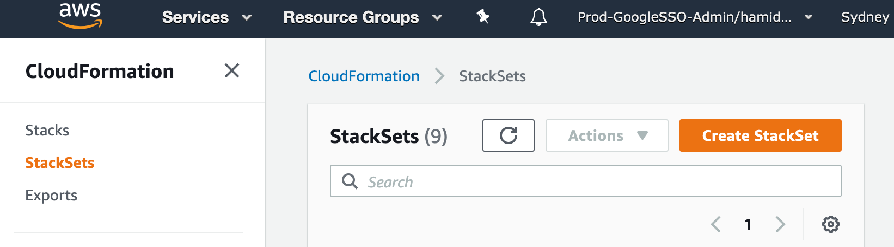
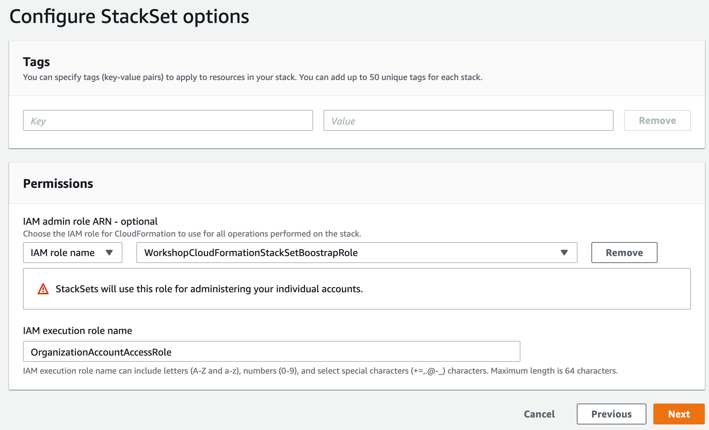
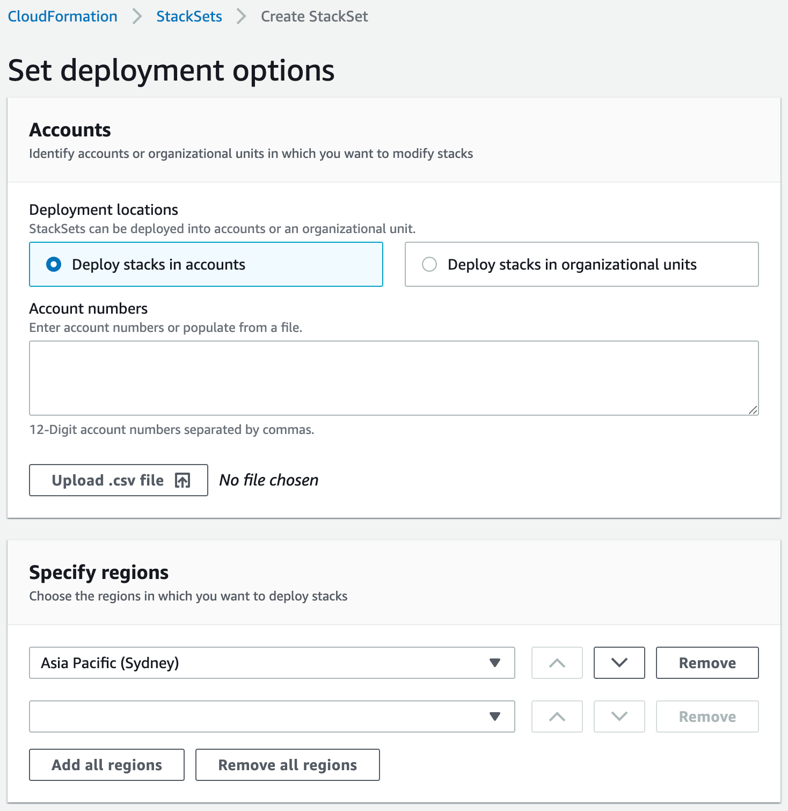

## CloudFormation StackSets

### Diagram

### StackSet Execution Role cont.

1.  Review `templates/stackset-execution-role.cf.yaml`. We want this template
    deployed in the sub-accounts.

1.  In the master account, go to **CloudFormation**.

1.  Click on **StackSets** and then **Create StackSet**.
    

1.  First Page:
    1.  Upload `templates/stackset-execution-role.cf.yaml` and click on
        **Next**.
        

1.  Second Page:
    1.  Call your StackSet `workshop-stackset-execution`.
    1.  Enter your master account`s number in the **AdministratorAccountId**
        parameter field and click on **Next**.
        

1.  Third Page:
    1.  Leave **Tags** empty.
    1.  For **IAM admin role ARN**, select the bootstrapping role we just
        created, `WorkshopCloudFormationStackSetBoostrapRole`.
    1.  Set **IAM execution role name** to `OrganizationAccountAccessRole` and
        click on **Next**.
        

1.  Fourth Page:
    1.  Select **Deploy stacks in accounts**.
    1.  Enter your both sub-account numbers, separating them with a comma.
    1.  **Specify regions**: `Asia Pacific (Sydney)` only.
    1.  Leave the rest as they are and click on **Next**.
        

1.  Review the configuration. Acknowledge that your template is creating IAM
    resources and click on **Submit**.

You'll now see your StackSets deploying. This may take a while. You can refresh
the **Operations** tab to see the progress. Alternatively, you can switch into
the sub-accounts and inspect the CloudFormation Stack that's being deployed in
it.

Now with the `WorkshopCloudFormationStackSetExecutionRole` we can run
CloudFormation with restricted access.
