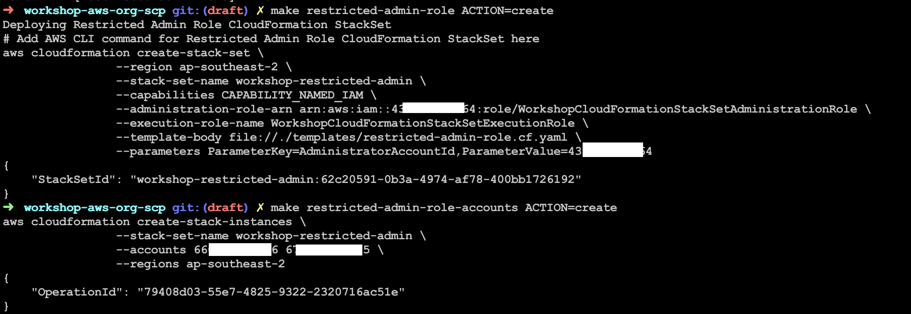

## IAM Roles

Now that our StackSets are ready, let's create our IAM resources. We will be
creating a role called `RestrictedAdmin`. As it is implied, it's an
administrator role however it's restricted to prevent intentional or accidental
changes to resources that are managed from the master account. For example, you
don't want users of this role to disable CloudTrail Logs or modify existing
networking resources, but you are happy for them to manage their own IAM
resources.

### The Role

1. Review `templates/restricted-admin-role.cf.yaml`.

1. Add the following commands to `restricted-admin-role` target in `Makefile`:
    ```Makefile
    aws cloudformation $(ACTION)-stack-set \
    	--region $(REGION) \
    	--stack-set-name $(RESTRICTEDADMIN_STACKSETNAME) \
    	--capabilities CAPABILITY_NAMED_IAM \
    	--administration-role-arn arn:aws:iam::$(MASTER_ACC_NUMBER):role/WorkshopCloudFormationStackSetAdministrationRole \
    	--execution-role-name WorkshopCloudFormationStackSetExecutionRole \
    	--template-body file://./templates/restricted-admin-role.cf.yaml \
    	--parameters ParameterKey=AdministratorAccountId,ParameterValue=$(MASTER_ACC_NUMBER)
    
    aws cloudformation $(ACTION)-stack-instances \
    	--stack-set-name $(RESTRICTEDADMIN_STACKSETNAME) \
    	--accounts $(ACC1_NUMBER) $(ACC2_NUMBER) \
    	--regions $(REGION)
    ```

1. Deploy this template
    ```Bash
    $ make restricted-admin-role ACTION=create
    $ make restricted-admin-role-accounts ACTION=create
    ```

Our `RestrictedAdmin` role is deployed across both our sub-accounts, but
currently it's more privileged that we intended.

