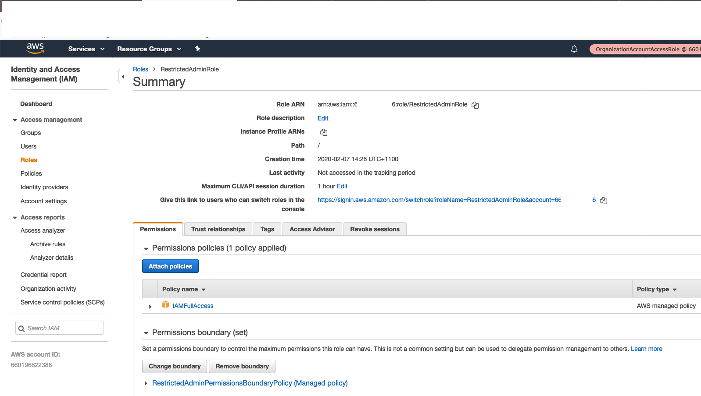

## IAM Roles

We are now going to impose some restrictions on the `RestrictedAdmin` role.
We can Deny permissions on CloudTrail or VPC resources, however if this role
can create its own IAM Roles and Policies, what's there to stop
`RestrictedAdmin` from creating roles that can modify CloudTrail and VPC
resources?

### Permissions Boundary

> A permissions boundary is an advanced feature for using a managed policy to
> set the maximum permissions that an identity-based policy can grant to an IAM
> entity. An entity's permissions boundary allows it to perform only the
> actions that are allowed by both its identity-based policies and its
> permissions boundaries.


1. Add the following commands to `restricted-admin-role` target in `Makefile`:
    ```YAML
    RestrictedAdminPermissionsBoundaryPolicy:
      Type: AWS::IAM::ManagedPolicy
      Properties:
        ManagedPolicyName: RestrictedAdminPermissionsBoundaryPolicy
        Description: Policy for RestrictedAdmin Role and IAM entities managed by it
        Path: "/"
        PolicyDocument:
          Version: 2012-10-17
          Statement:
            - Sid: GeneralRestrictions
              Effect: Deny
              Action:
                - ec2:*NetworkAcl*
                - ec2:*Subnet*
                - ec2:*Vpc*
                - ec2:*Endpoint*
                - ec2:*Vpn*
                - ec2:*Gateway*
                - ec2:*Route*
                - cloudtrail:*
              Resource: '*'
            - Sid: RestrictedIAM
              Effect: Deny
              Action:
                - iam:CreateRole
                - iam:AttachRolePolicy
                - iam:PutRolePermissionsBoundary
                - iam:TagRole
                - iam:UntagRole
                - iam:UpdateRole*
              Resource: '*'
              Condition:
                StringNotEquals:
                  iam:PermissionsBoundary:
                  - !Sub "arn:aws:iam::${AWS::AccountId}:policy/RestrictedAdminPermissionsBoundaryPolicy"
    ```

1. Add the following property to `RestrictedAdminRole` in the same template:
    ```YAML
    PermissionsBoundary: !Ref RestrictedAdminPermissionsBoundaryPolicy
    ```

1. Deploy the changes
    ```Bash
    $ make restricted-admin-role ACTION=update
    ```

Pay attention to the `RestrictedIAM` statement and its `Condition`. This
statement simply denies any IAM requests unless the permissions boundary is
specified on the resource that's the subject of that request.

You can **Switch Role** from your master account into the `RestrictedAdmin`
role in either of your sub-accounts. Try performing different tasks and see
which ones are permitted and which ones are not. Definitely try to create IAM
resources. Can you make an IAM Policy? What about an IAM Role? Can you think of
ways to circumvent this set up?


### Further Reading
* https://docs.aws.amazon.com/IAM/latest/UserGuide/access_policies_boundaries.html
* https://docs.aws.amazon.com/IAM/latest/UserGuide/reference_policies_evaluation-logic.html
