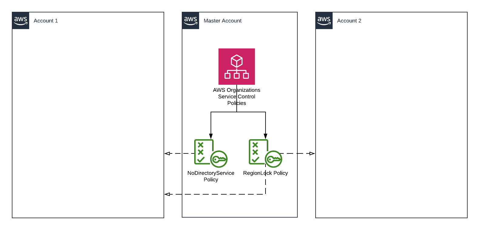
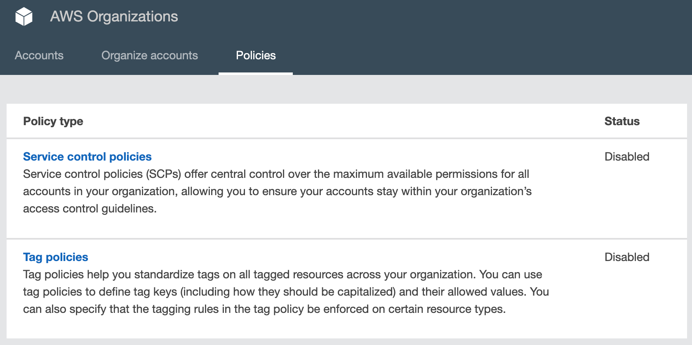
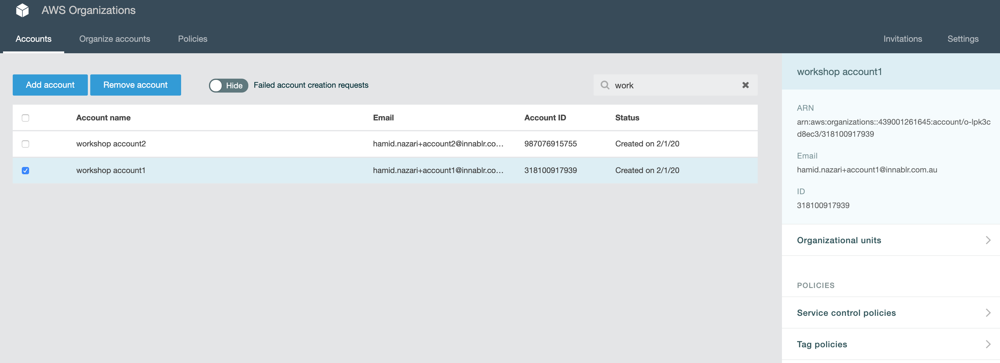
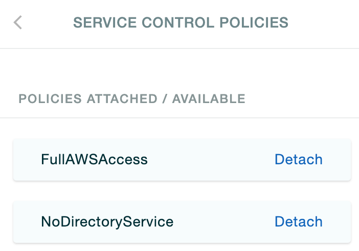

## Service Control Policies

There are times that you may want certain services entirely disabled in your
account. For example, your organisation has its own Directory Service and you
want your users to continue using it.

Or, you may want your organisation to use only specific regions. While these
restrictions can be imposed using Permissions Boundaries, there is a central
and less repetitive way of doing this.

>   **NOTE:** IAM Managed Policies have a 6KB character limit. Sooner or later
>   you will reach this limit as more statements are added to your policy.

### Diagram



### Steps

Let's create a Service Control Policy.

1.  Switch back to the master account.

1.  Go to **AWS Organizations**.

1.  Click on the **Policies** tab.

    

1.  Click on **Service control policies** and **Enable** it.

1.  Click on **Create policy**.

1.  Enter the following details:
    *   **Policy name:** `NoDirectoryService`  
    *   In the **Policy** editor
        *   Choose `Directory Service`  
            Select `All actions (ds:*)`  
            This will add the service to the policy statement on the right.
        *   Click on **Add resource**  
            **AWS Service:** `Directory Service`  
            **Resource Type:** `All Resources`  
            **Resource ARN:** `*`  
            Add the resource.
        *   Ignore the **condition** field.

        Your policy should now look like this:
        ```json
        {
        	"Version": "2012-10-17",
        	"Statement": [
        		{
        			"Sid": "Statement1",
        			"Effect": "Deny",
        			"Action": [
        				"ds:*"
        			],
        			"Resource": [
        				"*"
        			]
        		}
        	]
        }
        ```

    *   Click on **Create policy**.

1.  Now head back to the **Accounts** tab, and pick `Workshop Account 1`.
    

    *   From the right hand menu, click on **Service control policies**.
    *   Now **Attach** the policy we just created, `NoDirectoryService`.
    *   Do not remove Detach `FullAWSAccess`. Can you tell why?

    

>   **NOTE:** Service Control Policies syntax is similar to that of IAM however
>   there are a few exceptions. For example *Condition* or *Resource* keys only
>   work with *Deny* effects. Which means you cannot conditionally Allow an
>   *Action*, however you can conditionally Deny it.

Okay, now let's create a region restricted policy using the CLI.

1.  Create a file named `region-lock-scp.json` in the `templates` directory with
    the following contents:
    ```json
    {
    	"Version": "2012-10-17",
    	"Statement": [{
    		"Effect": "Deny",
    		"Action": "*",
    		"Resource": "*",
    		"Condition": {
    			"StringNotEquals": {
    				"aws:RequestedRegion": [
    					"ap-southeast-2",
    					"us-east-1"
    				]
    			}
    		}
    	}]
    }
    ```

1.  Add the following command to the `region-lock-scp` target in `Makefile`:
    ```Makefile
    aws organizations $(ACTION)-policy \
    	--content file://./templates/region-lock-scp.json \
    	--name RegionLock --description '' \
    	--type SERVICE_CONTROL_POLICY
    ```

1.  And these to the `region-lock-attachment` target:
    ```Makefile
    aws organizations attach-policy --target-id $(ACC1_NUMBER) --policy-id $(POLICY_ID)
    aws organizations attach-policy --target-id $(ACC2_NUMBER) --policy-id $(POLICY_ID)
    ```

1.  Create the policy by running Make.
    ```Bash
    $ make region-lock-scp ACTION=create
    ```
    Note down the Policy ID in the response. We need to use it in the next step.

1.  Now attach the policy. Change the value of `POLICY_ID` accordingly.
    ```Bash
    $ make region-lock-attachment POLICY_ID=p-12345678
    ```

Now this policy is attached to both your sub-accounts. `Account 1` has further
restrictions on Directory Services usage. Both accounts cannot use any region
that is not `ap-southeast-2` or `us-east-1`.

>   **NOTE:** Never fully Deny access to `us-east-1`. Can you guess why?

### Further Reading

*   https://docs.aws.amazon.com/organizations/latest/userguide/orgs_manage_policies_scp.html
*   https://aws.amazon.com/blogs/security/how-to-use-service-control-policies-to-set-permission-guardrails-across-accounts-in-your-aws-organization/
*   https://docs.aws.amazon.com/organizations/latest/userguide/orgs_reference_scp-syntax.html
